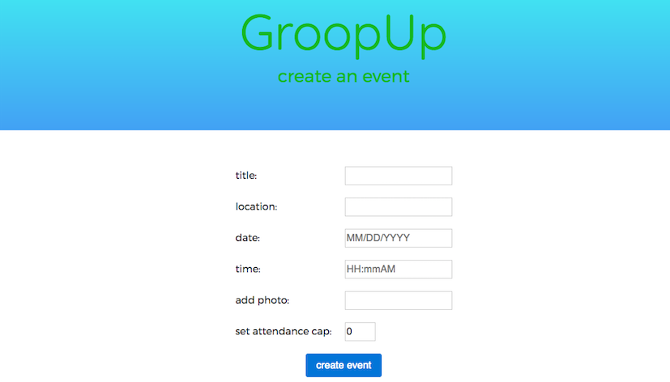

# GroopUp
Save money with new friends on cool activities! A more social GroupOn and a more personalized Eventbrite – users get access to activities/services over which friendships form, selecting these activities/services based on various factors such as personality compatibility with existing activity/service participants, number of participants, location, price, etc.

## Getting Started

These instructions will get you a copy of the project up and running on your local machine for development and testing purposes. See deployment for notes on how to deploy the project on a live system.

##Prerequisites

mySQL WORKBENCH

### Installing

In the command line:

-npm install

node server.js

### Landing Page

checkout events without creating an account

### Business Account

Create a business account to post your own events

### User View

Create a user account and save your preferences through a personality test to see the events that are most compatible for you

## Deployment

deployed with Heroku - [GroopUp](http://groopup.herokuapp.com/)

## Built With

* [handlebars](http://handlebarsjs.com/) - The web framework used
* [Sequelize](http://docs.sequelizejs.com/) - ORM used for working with database
* [Bootstrap](http://getbootstrap.com/) - CSS framework
* [Passportjs](http://passportjs.org/docs) - User authentication middleware

## Authors

* **Jake Park** - [bluffingtuna](https://github.com/bluffingtuna)
* **John Nguyen** - [drjohnsez](https://github.com/drjohnsez)
* **Clinton Diamond** - [cdiamond06](https://github.com/cdiamond06)
* **Paige Pittman** - [paigepittman](https://github.com/paigepittman)

See also the list of [contributors](https://github.com/GroopUp/GroopUp/graphs/contributors) who participated in this project.
